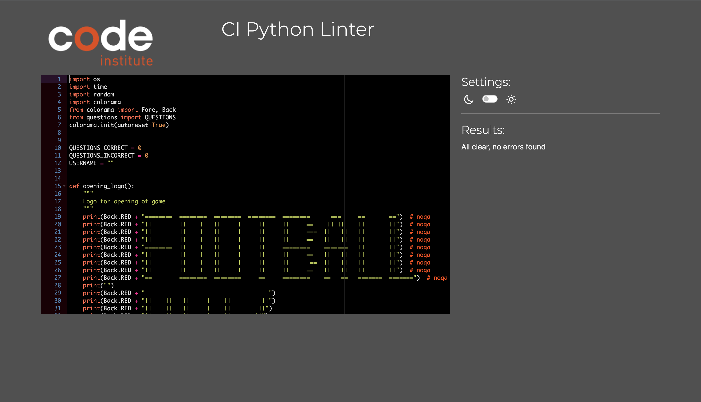
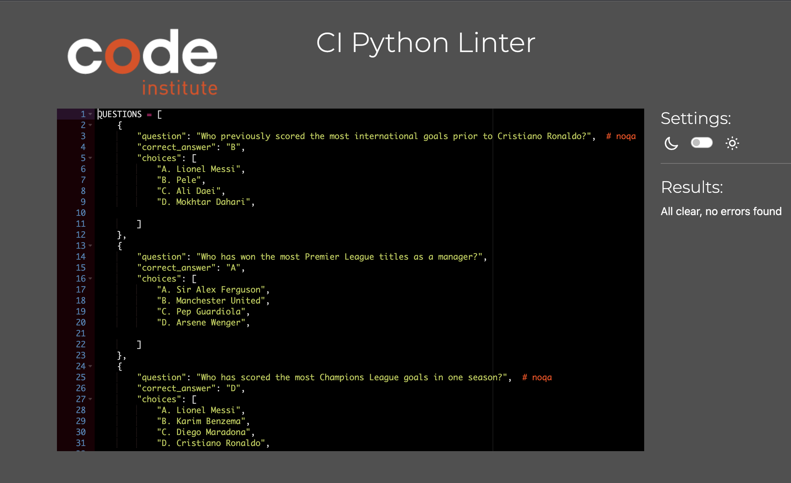

# Testing

Return back to the [README.md](README.md) file.

## Code Validation

### Python

I have used the recommended [CI Python Linter](https://pep8ci.herokuapp.com) to validate all of my Python files.

| File | CI URL | Screenshot | Notes |
| --- | --- | --- | --- |
| run.py | [CI PEP8](https://pep8ci.herokuapp.com/https://raw.githubusercontent.com/JoshuaCarroll1/football-quiz/main/run.py) |  |  |
| questions.py | [CI PEP8](https://pep8ci.herokuapp.com/https://raw.githubusercontent.com/JoshuaCarroll1/football-quiz/main/questions.py) |  |  |

## Lighthouse Audit

I've tested my deployed project using the Lighthouse Audit tool to check for any major issues.

| Page | Size | Screenshot | Notes |
| --- | --- | --- | --- |
| Heroku | Mobile |  | Some minor warnings |
| Heroku | Desktop |  | Some minor warnings |

## Defensive Programming

Defensive programming was manually tested with the below user acceptance testing:

| Page | User Action | Expected Result | Pass/Fail | Screenshot |
| --- | --- | --- | --- | --- |
| run.py | Enter answer for quiz| User must enter a validate answer i.e A, B, C, D or answer will be incorrect| Pass |  |
| run.py | Enter username | User should enter valid username | Pass |  |
| run.py | Enter answer for quiz | User will be be asked to enter a correct answer | Pass |  |
| run.py | Ener username | User must enter name with more then 3 letters but less then 15 | Pass |  |
| run.py | Ener username | User must enter name with just letters | Pass |  |

## User Story Testing

| User Story | Screenshot |
| --- | --- |
| As a new site user, I would like to be able to add my name, so that I can be called my name. |  |
| As a new site user, I would like to get random questions, so that I can answer questions. |  |
| As a new site user, I would like to see how many questions I got correct, so that I can see how many I got incorrect. |  |
| As a returning site user, I would like to see new questions, so that I can answer different questions. |  |
| As a returning site user, I would like to be able to replay the game within the game, so that I can quickly restart the quiz. |  |
| As a returning site user, I would like to see what questions I get wrong, so that I can correct them in the future. |  |

## Unfixed Bugs

There are no remaining bugs that I am aware of.
